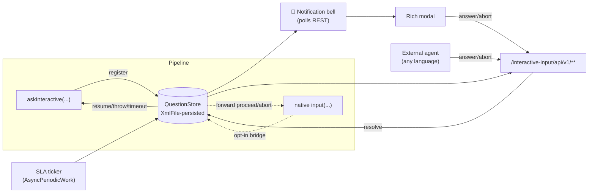

# Interactive Input

> A notification bell and a rich human‑in‑the‑loop (HITL) modal for Jenkins pipelines that pause for a human decision — plus a language‑agnostic REST API so any external agent (a bot, a script, an AI copilot) can answer on a human's behalf.

[](https://www.jenkins.io/)
[](https://adoptium.net/)
[](LICENSE)
[](https://www.jenkins.io/doc/book/pipeline/)
[](https://www.jenkins.io/projects/jcasc/)

---

## Table of contents

- [Why this plugin exists](#why-this-plugin-exists)
- [`input` vs `interactive-input`](#input-vs-interactive-input)
- [Features](#features)
- [How it works](#how-it-works)
- [Install](#install)
- [Quick start](#quick-start)
- [The `askInteractive` step](#the-askinteractive-step)
- [REST API](#rest-api)
- [Bridging existing `input` steps](#bridging-existing-input-steps)
- [Configuration (UI + JCasC)](#configuration-ui--jcasc)
- [Security model](#security-model)
- [Language applicability & restrictions](#language-applicability--restrictions)
- [Compatibility matrix](#compatibility-matrix)
- [Build from source](#build-from-source)
- [Project docs](#project-docs)
- [License](#license)

---

## Why this plugin exists

Jenkins has shipped a pipeline `input` step for years. It works, but it has two long‑standing gaps for teams doing serious human‑in‑the‑loop automation:

1. **There is no in‑UI signal that a build is waiting for you.** A paused build sits silently until someone happens to open the right build page. Approvers miss deploys; pipelines idle for hours against their will.
2. **The approval surface is minimal.** The built‑in prompt is a message, an OK button, and optional form parameters. There is no place for rich context (release notes, a diff, a risk summary), no notion of *why* each choice exists, and no first‑class way for an **external agent** to answer programmatically with a clean, versioned contract.

`interactive-input` closes both gaps **without changing anything about how your existing pipelines behave**. It adds a notification bell, a rich modal, a durable `askInteractive` step, and a REST API — all opt‑in, all governed by the same permission model Jenkins already enforces on `input`.

---

## `input` vs `interactive-input`

Both pause a pipeline and wait for a human. Here is what changes:

| Capability | Built‑in `input` | `interactive-input` |
|---|---|---|
| Pause a pipeline for a human decision | ✅ | ✅ (`askInteractive`) |
| **In‑UI notification bell + unread count** | ❌ (silent until you open the build) | ✅ nav‑bar/floating bell, polled |
| **Rich modal** (context panel, per‑choice rationale) | ❌ message + OK only | ✅ Markdown context, choices with a "why", free‑text w/ live preview |
| **Structured choices with rationale** | ⚠️ via form parameters only | ✅ `[id, label, why]` first‑class |
| **Versioned JSON REST API** for external agents | ❌ (internal Stapler form POST) | ✅ `/interactive-input/api/v1/**` |
| **Answer from a script / bot / AI agent** | ⚠️ brittle (scrape crumb + form) | ✅ documented `POST …/answer` contract |
| **SLA / auto‑expiry** | ❌ waits forever (unless you code a `timeout{}`) | ✅ per‑step `slaMinutes` + global default |
| **Surfaces *existing* `input` steps** | n/a | ✅ opt‑in `inputStepBridge` (no pipeline edits) |
| **Safe Markdown rendering** | n/a | ✅ server‑side escaped (no raw HTML/script) |
| **JCasC configuration** | partial | ✅ every capability, `unclassified.interactiveInput` |
| Durable across controller restart | ✅ | ✅ (same durable‑step foundation) |
| Permission model | Item.BUILD / submitter | ✅ **identical** (mirrors `pipeline-input-step`) |
| Runtime AI dependency | n/a | ❌ none — the API is generic HITL plumbing |

**TL;DR** — `interactive-input` is a *superset UX and an integration surface* on top of the same durable, permission‑checked foundation as `input`. You can adopt it incrementally: flip on the bridge to light up existing inputs, or write new `askInteractive` steps when you want the richer surface.

---

## Features

- 🔔 **Notification bell** — a badge with the count of questions *you* are allowed to answer, polled at a configurable cadence (no WebSocket/SSE, so it works through every corporate proxy).
- 🪟 **Rich modal** — Markdown context panel, radio choices each with an optional rationale, optional free‑text with a live (server‑sanitised) preview, full keyboard/focus‑trap accessibility.
- 🧩 **`askInteractive` step** — a durable pipeline step that returns the chosen id (or free text), throws on abort, and times out on SLA.
- 🌐 **Versioned REST API** — `GET/POST` JSON under `/interactive-input/api/v1/`, permission‑checked, CSRF‑protected, with a stable envelope.
- 🌉 **`inputStepBridge`** — opt‑in reconciliation that mirrors *existing* native `input` steps into the bell/modal/API, forwarding answers back to the native step. Zero pipeline changes.
- ⏱️ **SLA + retention** — expire overdue questions; compact terminal ones after a retention window.
- ⚙️ **JCasC‑native** — configure everything as code; every capability is a feature flag.
- 🔒 **Secure by construction** — server‑side Markdown escaping, permission checks at every endpoint, no existence leaks, admin‑gated global list.

---

## How it works



A paused step registers a `Question` in a durable, permission‑aware `QuestionStore`. The bell polls the REST API for questions the current user may answer; the modal (or any external agent) answers via `POST …/answer`; the store resolves the question and the pipeline resumes, throws (`abort`), or times out (SLA). Question metadata survives a controller restart via XStream; transient resolvers are re‑attached on step resume.

---

## Install

**Requirements:** Jenkins **2.555.2+**, Java **17+**, and `pipeline-input-step` **≥ 560** (see [compatibility](#compatibility-matrix)).

### From the built HPI

1. **Manage Jenkins → Plugins → Advanced → Deploy Plugin** and upload `interactive-input.hpi`, **or** drop the HPI into `$JENKINS_HOME/plugins/` and restart.
2. Confirm the bell appears and the health probe answers:

```bash
curl -s http://<jenkins>/interactive-input/api/v1/health
# {"status":"ok","pending":0}
```

### From the Update Center

Once published to [plugins.jenkins.io](https://plugins.jenkins.io/), search **"Interactive Input"** in **Manage Jenkins → Plugins → Available**.

---

## Quick start

```groovy
pipeline {
  agent any
  stages {
    stage('Approve deploy') {
      steps {
        script {
          def answer = askInteractive(
            prompt: 'Deploy build to production?',
            choices: [
              [id: 'approve', label: 'Approve', why: 'Release notes look good; all checks green.'],
              [id: 'reject',  label: 'Reject',  why: 'Needs another round of testing.']
            ],
            allowFreeText: true,
            contextMarkdown: '''## Release 4.2.0
- Fixes CVE‑2026‑1234
- Adds retry to the payment worker''',
            slaMinutes: 30
          )
          echo "Human chose: ${answer}"
        }
      }
    }
  }
}
```

When this build reaches the step it pauses, the bell lights up for everyone allowed to answer, and the pipeline resumes the moment a human (or an authorised agent) responds.

---

## The `askInteractive` step

| Parameter | Type | Default | Description |
|---|---|---|---|
| `prompt` | String (required) | — | The question shown as the modal title. Must not be blank. |
| `choices` | List of maps | `[]` | Each: `[id: 'x', label: 'Label', why: 'optional rationale']`. |
| `allowFreeText` | boolean | `false` | Allow a Markdown free‑text answer with live preview. |
| `slaMinutes` | int | `-1` → global default | Auto‑expire after N minutes. `0` = wait forever. |
| `submitterFilter` | String | `null` | Comma‑separated users/groups permitted to answer (same semantics as `input`'s `submitter`). |
| `contextMarkdown` | String | `null` | Rich context rendered (safely) in the modal. |
| `escalation` | String | `null` | Reserved for v0.2 (Slack/email/PagerDuty). Accepted but ignored in v0.1. |

**Return value**

- A **choice** was picked → the choice `id` (`String`).
- **Free text** was submitted → `[text: '…', choice: null]`.
- **Abort / Deny** → throws `AbortException` (fails the stage unless you `catch` it).
- **SLA expiry** → throws a timeout, so a paused build cannot idle forever.

---

## REST API

Base path: `/interactive-input/api/v1/`. All responses are JSON. Mutating endpoints require `POST` **and** a Jenkins CSRF crumb.

| Method | Path | Permission | Purpose |
|---|---|---|---|
| `GET` | `/health` | anonymous | Liveness probe: `{"status":"ok","pending":N}`. |
| `GET` | `/questions` | Overall/Read | Questions **you** can answer. `?all=true` ⇒ every waiting question (**Overall/Administer**). |
| `GET` | `/questions/{id}` | Item/Read on source job | Full detail incl. sanitised `contextHtml` (404 if missing *or* unreadable — no existence leak). |
| `POST` | `/questions/{id}/answer` | Item/Build (or submitter) | Submit `{"choiceId":"…"}` or `{"freeText":"…"}`. |
| `POST` | `/questions/{id}/abort` | Item/Build (or submitter) | Cancel the input (delivers an abort to the pipeline). |
| `POST` | `/preview` | Overall/Read | Render Markdown → safe HTML (used by the modal's free‑text preview). |

### Worked example (`curl`)

```bash
BASE=http://<jenkins>
# 1) CSRF crumb (session-bound — keep the cookie jar)
CRUMB=$(curl -s -c cj.txt -u "$USER:$TOKEN" \
  "$BASE/crumbIssuer/api/json" \
  | python3 -c "import json,sys;d=json.load(sys.stdin);print(d['crumbRequestField']+':'+d['crumb'])")

# 2) List questions I can answer
curl -s -b cj.txt -u "$USER:$TOKEN" "$BASE/interactive-input/api/v1/questions"
# {"count":1,"questions":[{"id":"…","prompt":"Deploy build to production?","choices":[…],"allowFreeText":true,"jobFullName":"deploy","buildNumber":42,"status":"WAITING","remainingMs":1740000, …}]}

# 3) Answer with a choice
curl -s -b cj.txt -u "$USER:$TOKEN" -H "$CRUMB" -H 'Content-Type: application/json' \
  --data '{"choiceId":"approve"}' \
  "$BASE/interactive-input/api/v1/questions/<id>/answer"
# {"id":"…","status":"ANSWERED","answer":{"choiceId":"approve","answeredBy":"darnr", …}}
```

**Answer envelope** — `choiceId` must match a declared choice (or the `__deny__` sentinel); `freeText` is only accepted when the question set `allowFreeText: true`. Invalid answers → `400`; unauthorised → `403`; already‑settled → `409`.

---

## Bridging existing `input` steps

Turn on **`inputStepBridge`** and every *pending native `input`* is mirrored into the bell, modal, and REST API — with **no pipeline changes**:

- Parameter‑less inputs get a single **Approve / Proceed** choice; answering it (via modal or REST) forwards to the native step's `proceed`, honouring any `submitterParameter`.
- **Deny** forwards to the native `abort`.
- Parameterised inputs are surfaced read‑only with a deep link to the build's input form (full in‑modal parameter answering is a v0.2 item).
- If a user answers via the built‑in UI instead, the next reconciliation drops the now‑settled mirror.

This is the fastest way to get notifications for pipelines you don't want to rewrite.

---

## Configuration (UI + JCasC)

**Manage Jenkins → System → Interactive Input**, or as code under `unclassified.interactiveInput`:

```yaml
unclassified:
  interactiveInput:
    features:
      askInteractiveStep: true   # the askInteractive step
      navBarBell: true           # the notification bell
      richModal: true            # rich modal (else deep-link to the build)
      restApi: true              # /interactive-input/api/v1/**
      inputStepBridge: false     # surface existing native input steps (opt-in)
      dashboardTile: false       # reserved for v0.2
    polling:
      intervalSeconds: 15        # bell poll cadence (min 5)
    sla:
      defaultMinutes: 0          # default SLA when a step omits slaMinutes (0 = no SLA)
    retentionDays: 7             # keep answered/aborted/expired questions this long
```

Defaults: the step, bell, modal, and REST API are **on**; the bridge and dashboard tile are **off**.

---

## Security model

- **Permissions mirror `pipeline-input-step`.** Answering/aborting requires `Item/Build` on the source job, or — when a `submitterFilter` is set — membership in that user/group set (with the usual `Overall/Administer` bypass). Viewing requires `Item/Read`.
- **CSRF everywhere it mutates.** Every `answer`/`abort`/`preview` is `@RequirePOST`, so Jenkins' crumb filter applies.
- **No existence leak.** `GET /questions/{id}` returns `404` whether the question is missing *or* you lack `Item/Read`.
- **Admin‑gated global view.** `?all=true` requires `Overall/Administer`; the default list is scoped to what you can answer.
- **Safe Markdown.** `contextMarkdown` and free‑text are rendered with commonmark configured to **escape raw HTML** and **sanitise URLs** (`javascript:` and friends are stripped). The client inserts only server‑sanitised HTML via `innerHTML`; all other user data goes through `textContent`.
- **Only `/health` is anonymous** (a liveness probe that leaks nothing but a pending count).

See [`docs/SECURITY.md`](docs/SECURITY.md) for the threat model and how to report issues.

---

## Language applicability & restrictions

**Is this HITL surface usable from any programming language?** Yes — with one nuance worth understanding:

- ✅ **The REST API, bell, modal, and bridge are language‑agnostic.** Any agent that speaks HTTP — Python, Go, Node, Rust, Bash + `curl`, an AI copilot — can list, answer, and abort questions. The controlled program (your app under test, your deploy tool, your model) can be written in **any language**. This is the layer that makes `interactive-input` a general HITL rendezvous, not a Groovy‑only feature.
- ⚠️ **Authoring the `askInteractive` step is Jenkins Pipeline (Groovy).** Like every Jenkins pipeline step, `askInteractive` is called from a `Jenkinsfile`. Your *non‑Groovy* program participates by (a) being orchestrated by that pipeline and/or (b) answering via the REST API. You do **not** rewrite your app in Groovy — the pipeline is just the place the pause is declared.
- ➡️ **Already have `input` steps in another team's pipelines?** Flip on `inputStepBridge` and they light up in the bell with zero code changes.

**Restrictions (v0.1):**

| # | Restriction | Why |
|---|---|---|
| 1 | Jenkins **2.555.2+**, Java **17+** | Built against the 2.555.x BOM on Java 17 bytecode. |
| 2 | `pipeline-input-step` **≥ 560** | The bridge/modal target the dialog surface added in 560. |
| 3 | `askInteractive` runs in **Pipeline** jobs (not Freestyle) | It's a pipeline step; Freestyle has no step model. Freestyle/other jobs can still use the **REST API**. |
| 4 | Notifications are **polled**, not pushed | No SSE/WebSocket in v0.1 (proxy‑friendly by design). Cadence ≥ 5s. |
| 5 | Bridge answers **parameter‑less** native inputs in‑modal | Parameterised native inputs deep‑link to the build form (v0.2). |
| 6 | Escalation (Slack/email/PagerDuty) is **accepted but ignored** | Reserved for v0.2. |

---

## Compatibility matrix

| Component | Version | Notes |
|---|---|---|
| Jenkins core | `2.555.2+` | pinned via `bom-2.555.x` |
| Java | `17` (built on JDK 21) | `maven.compiler.release=17` |
| `pipeline-input-step` | `≥ 560.v56198a_642157` | **hard requirement** (modal + bridge) |
| `configuration-as-code` | optional | JCasC is optional at runtime |
| `commonmark` | `0.24.0` | bundled in the HPI for safe Markdown |

Full dependency inventory: [`docs/BILL_OF_MATERIALS.md`](docs/BILL_OF_MATERIALS.md).

---

## Build from source

```bash
# Requires JDK 17+ and Maven 3.8.6+
mvn -B -ntp clean verify      # runs the full test suite + SpotBugs
ls target/interactive-input.hpi
```

Behind a corporate proxy, configure `~/.m2/settings.xml` and point Maven at `https://repo.jenkins-ci.org/public/` (see [`SESSION_NOTES.md`](SESSION_NOTES.md)).

---

## Project docs

| Doc | What's in it |
|---|---|
| [`CHANGELOG.md`](CHANGELOG.md) | Release history (Keep a Changelog). |
| [`CONTRIBUTING.md`](CONTRIBUTING.md) | Dev setup, coding standards, PR flow. |
| [`docs/BILL_OF_MATERIALS.md`](docs/BILL_OF_MATERIALS.md) | Full dependency + build BOM with versions and licenses. |
| [`docs/LICENSING.md`](docs/LICENSING.md) | Why MIT, and a primer on OSS license families. |
| [`docs/SECURITY.md`](docs/SECURITY.md) | Threat model + responsible disclosure. |
| [`SESSION_NOTES.md`](SESSION_NOTES.md) | Build/verify evidence, versions, live‑test transcript. |

---

## License

Released under the [MIT License](LICENSE) © 2026 Darniss `<darniss.mail@gmail.com>`.

> Maintainer: **Darniss** — `darniss.mail@gmail.com`
